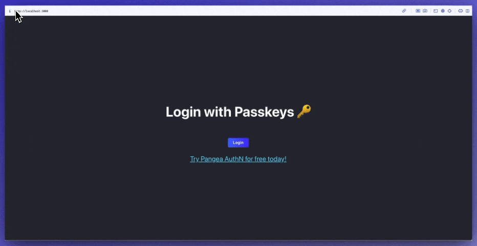

# ReactJS "Login with Passkey" template

This repository is a template that uses [Pangea AuthN](https://l.pangea.cloud/6YIN6PM) to enable Passkey based authentication in < 2mins

For full instructions, refer to this [blog](https://pangea.cloud/blog/add-passkeys-to-reactjs-in-2mins/?utm_source=github&utm_medium=reactjs-passkeys-readme).

## Deploy
<!-- Deploy with Vercel button -->
[](https://vercel.com/new/clone?repository-url=https%3A%2F%2Fgithub.com%2Fpangeacyber%2Freact-authn-passkeys-template&env=REACT_APP_LOGIN_URL,REACT_APP_CLIENT_TOKEN,REACT_APP_PANGEA_DOMAIN&envDescription=To%20get%20the%20following%20environment%20variables%2C%20signup%20for%20a%20free%20Pangea%20account%20at%20https%3A%2F%2Fl.pangea.cloud%2F6YIN6PM%20and%20grab%20your%20tokens%20from%20AuthN%20%3E%20Overview%20%3E%20Tokens&envLink=https%3A%2F%2Fl.pangea.cloud%2F6YIN6PM&demo-title=ReactJS%20%2B%20Pangea%20AuthN%20%22Login%20with%20Passkey%22%20Template&demo-description=Add%20Pangea%20AuthN%20%22Login%20with%20Passkey%22%20in%20%3C%202mins%20with%20this%20template.)

## Watch in Action ✨

